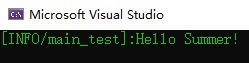

[](https://raw.githubusercontent.com/dotnetcore/CAP/master/LICENSE.txt)
[](https://www.nuget.org/packages/SummerFramework)
[](#)

# SummerFramework

README Languages: English (Current) | [简体中文 (Simplified Chinese)](./locals/README.zh_cn.md) 

Documents: [English](./docs/en_us.md) | [简体中文](./docs/zh_cn.md)

Framework for .NET programs in order to make development easier and faster!

## Features

- Manage obejcts through writing configuration file or attributes.
- Lightweight and easy to use.
- Convenient and simple UnitTest.

## Quick Start
1. Download the latest version of SummerFramework with Nuget.

2. Using the namespace`SummerFramework` and its child namespaces.

3. Create a config-file,

```json

{
  "framework": "summerframewrok",
  "framework_version": "alpha-1",
  "objects": [
    {
      "type": "string",
      "identifier": "str",
      "value": "Hello Summer!"
    }
  ]
}

```

and use its path to create config-context object, then get your object by its identifier to print it.

```c#

using SummerFramework.Core.Configuration;
using SummerFramework.Base;

var context = ResourceBasedConfigurationContext.Create("global_configuration.json");
context.GetObject("str")?.Log();

```

4. You can see "Hello Summer!" (green) in your console!


