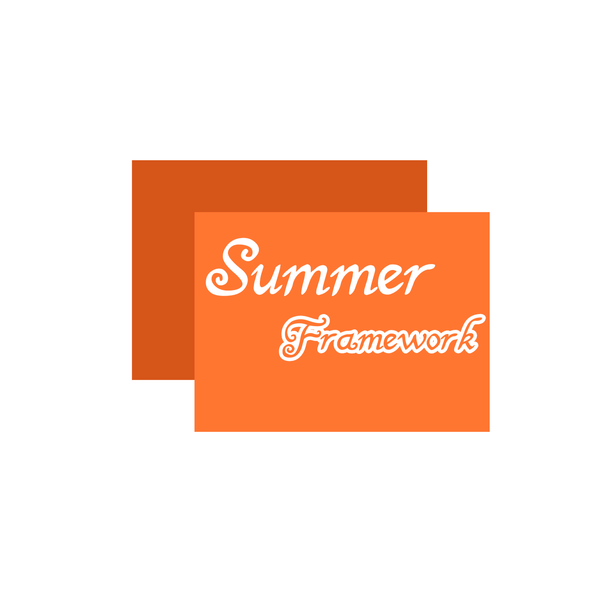
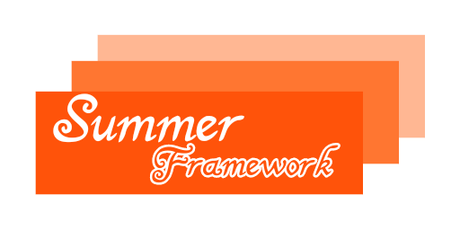

 

# SummerFramework

README语言: [English (英语)](../README.md) | 简体中文 (当前) 

为.NET程序准备的框架。

## 特性
- 允许您通过便携配置文件的方式装配对象。
- 快捷易用的单元测试。

## 用法

### 对象装配

首先，补充完您的global_configuration.json文件`(其中framework和framework-version不是必须的，它们用法提醒开发者)`

```json

{
  "framework": "summerframewrok",
  "framework_version": "alpha-1",
  "objects": [
    {
      "type": "string",
      "identifier": "str",
      "value": "Hello Summer!"
    }
  ]
}

```

然后您调用Configuration类中GLOBAL字段的GetObject(string identifier)方法获取装配好的对象。

别忘了强制转换成您所需的类型。

### 函数装配

为了配置一个函数，您应该在配置文件中新增`methods`区块。

然后指定其标识符和方法链接。

```json

"methods": {
  {
    "type": "function",
    "identifier": "add",
    "link": "TestSummer.Math@Add"
  }
}

```

您需要使用`类名@方法名`这样的格式指定方法链接

当您想要在`objects`区块中调用这个函数时，您需将`value`属性写成`@add(1,1)`的形式 (不允许空格间隔)

### 切面注入

想想这样一个场景，您需要在您出门之后检查一下门是否关上了。

如果写成代码，会是如下的样子:

```c#

person.OpenDoor();
person.GoOut();

if (!person.CheckDoorClosed())
  person.CloseDoor();

```

如您所见，`关门`的逻辑要比其他的逻辑更复杂一些。

在真实的开发场景中有数不胜数的复杂逻辑问题待定解决，故而会有很多代码重复情况！

通过使用切面注入，您便可以减少代码重复。

为了在`GoOut()`运行完之后做一些事情，我们需要将GoOut函数设定为虚方法，并且标记上`After`特性，并指定`AfterAction`的名称

```c#

using SummerFramework.Core.Aop;

public class Person
{
...
  [After("CloseDoor")]
  public virtual GoOut()
  {
    //TODO: Go out
  }
}
```

别忘记将`CloseDoor` 通过`AspectHandler`添加方法!

```c#

AspectHandler.AddAfter("CloseDoor", () => {
  if (!person.CheckDoorClosed())
  person.CloseDoor();
});

```

然后便可以自动地在GoOut()执行完之后自动执行`CloseDoor`了！

### 单元测试

SummerFramework内置了一些特性用于保证开发者更方便地测试一些功能 

单元测试应当在被标记了`TestClass`的类中进行，并且要测试的方法必须为静态方法且带有`Test`特性。

最后，在程序主入口中执行`TestController.Run()`来启用单元测试

```c#

using SummerFramework.Core.Test;

[TestClass]
public class Program
{
  static void Main(string[] args)
  {
    TestController.Run();
  }

  [Test]
  public static void Test1()
  {
    // TODO
  }
}

```
